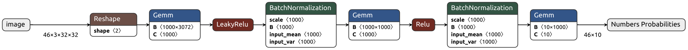

# Simple OCR Neural Network

---

Простая нейросеть, состоящая из трёх слоёв, решающая задачу распознавания цифр. 
Обучена и протестирована на датасете [SVHN](http://ufldl.stanford.edu/housenumbers/).
Точность на тестовых данных - более 80%.

Нейросеть реализована с использованием фреймворка **pyTorch**. 

Файл `main.py` содержит в себе весь цикл обучения модели, остальные файлы хранят в себе вспомогательные функции, помещенные отдельно для компактности.

Вдохновение и основу для этого решения взял из домашних заданий с курса лекций [dlcourse.ai](https://dlcourse.ai).
